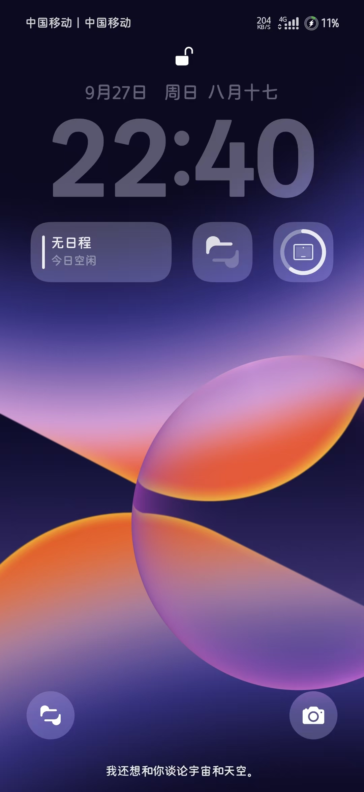
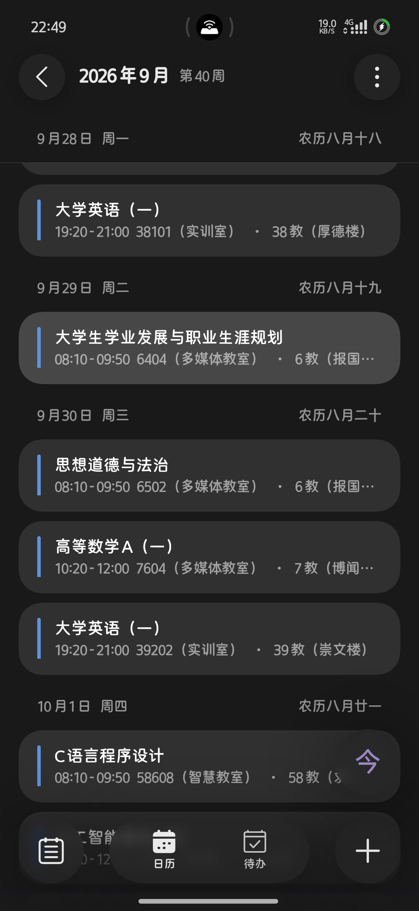
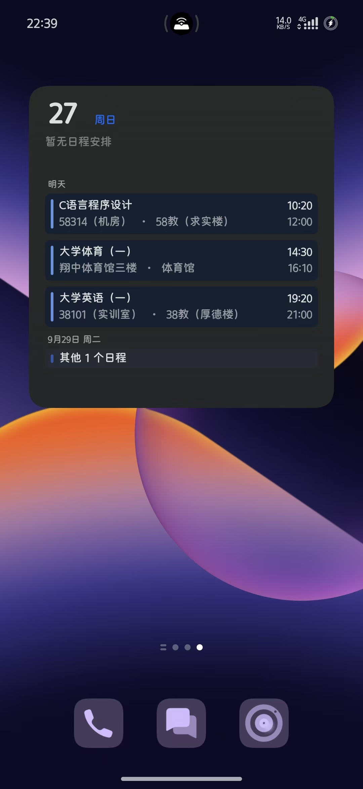

# 广理课表导出

把**广东理工学院教务系统**的课表,一键导出成手机日历能直接打开的文件。

导入之后,课表就躺在你手机的系统日历里了——查课不用再登录教务系统,也不用一周一周地翻。

<p align="center">
  <a href="https://github.com/Quack2026/CurriculumExporter/releases/latest">
    
  </a>
</p>

> **Windows 10 / 11** · **免安装** · 不需要 Python、Node 或任何环境 · **完全本地运行,不上传任何数据**

---

## 界面预览

<p align="center">
  
  
  
</p>

---

## 它能帮你省什么

教务系统只能**在线看**,没有导出。想要知道哪天第几节在哪上课,得一路点进去、再一周一周切——一学期二十周,翻起来相当烦。

这个工具把**整个学期**的课表一次性拉下来,变成标准日历文件。导入手机后:

- **课表直接进系统日历**,和你的其他日程放在一起看
- **课前提醒**用日历自带的就行,不用额外设置
- **军训那两周会单独标出来**,不会让你以为是"这两周没课"

---

## 怎么用

### 第一步:下载

点最上面那个绿色按钮,或直接去 [Releases](https://github.com/Quack2026/CurriculumExporter/releases/latest) 页面,下载 `CurriculumExporter-v1.0.0-windows-x64-net48.exe`。

> 第一次打开可能弹 Windows 的"已保护你的电脑"提示——这是因为个人项目买不起代码签名证书。点「**更多信息**」→「**仍要运行**」即可。
> 不放心的话,源码全在这个仓库里,一共 600 多行,随便看。

### 第二步:导出

双击运行 → 填学号和密码 → 点「获取课表」。

程序会自己登录、把 20 周全抓一遍,然后在**桌面**生成 `课表.ics`。整个过程十几秒,窗口里会一行行打印进度。

### 第三步:导入手机

把桌面上的 `课表.ics` 传到手机(微信发给自己、数据线、网盘都行),然后**用系统自带的「文件管理」打开它**,选择「日历」导入。

> **⚠️ 别在微信里直接点开这个文件。** 微信经常把它识别成普通二进制文件,手机就不会弹出「日历」这个选项了。
>
> **建议先新建一个叫「课表」的日历**专门装它(在日历 App 的「日历管理」里新建),以后课表要更新,直接删掉这一个日历就行,不会污染你自己的日程。

---

## 关于安全

同学之间传东西,这块得说清楚:

- **只连学校官网。** 程序唯一访问的地址是 `https://jwcydjw.gdlgxy.edu.cn`,没有任何第三方服务器、没有中转、没有数据上报。
- **不保存密码。** 你填的学号密码只存在于程序运行期间的内存里,关掉就没了——不写配置文件、不写注册表、不留日志。
- **传输是加密的。** 密码在提交前会按学校网页**自带的同一套方式**加密,再通过 HTTPS 发送。
  (说句实在话:那套加密的密钥是公开写在学校前端代码里的,所以它实质上等价于明文——**这是学校系统的设计问题,不是本工具引入的**。任何打开过那个网页的人都能拿到它。)
- **代码完全开源。** 你可以通读 `src/` 下的每一行,确认它没干别的。

---

## 常见问题

**导入后课程重复了?**
日历是按 UID 新建的,不查重,重复导入就会出现两套。**下次导入前,先把上次导入的那批事件删掉**(或者按上面说的,删掉整个「课表」日历重新导)。

**手机上的时间差了 8 小时?**
说明你的日历 App 没认出文件里的时区标记。目前 Android 和 iOS 自带日历都正常,遇到问题可以提 issue。

**课表变了怎么办?**
重新跑一次程序生成新的 `课表.ics`,手机端删掉旧的再导一次。

**能不能自动同步(课表一变手机就跟着变)?**
本工具是**一次性导出**。真正的自动同步需要服务器端 CalDAV 支持,复杂得多,不在这个项目范围内。

**会被学校发现吗?**
程序只是在模拟你自己在网页上的操作,频率是十几秒一次、一学期就这一个请求量。**但请只导出你自己的课表**,别拿去批量抓别人数据。

---

## 给开发者

<details>
<summary>自己编译 / 技术细节(点开)</summary>

### 编译

需要 .NET Framework 4.x(Win10/11 自带)或 Visual Studio Build Tools:

```powershell
powershell -ExecutionPolicy Bypass -File build.ps1
```

`build.ps1` 会优先使用 Roslyn 编译器(支持 `/deterministic`,同源码反复编译哈希一致);
只有系统自带的旧 `csc` 也能编,但它会把编译时间写进 PE 头,导致每次哈希都不同——这是编译器的老毛病,不是程序有问题。

### 登录接口

```
POST https://jwcydjw.gdlgxy.edu.cn/njwhd/login
     ?userNo=<学号>&pwd=<加密后密码>&encode=1
```

密码处理与学校前端 `xC.encrypt` + `btoa` 完全一致:

```
pwd = base64( AES-128-ECB( JSON.stringify(密码), key="<前端硬编码 key>" ) )
```

登录成功返回 JWT,后续请求用 `token` 请求头携带。

### 课表接口

```
POST /njwhd/student/curriculum?week=<1..20>&kbjcmsid=<班级课表标识>
```

按周返回 7 天日期网格和课程明细(课程名、教师、教室、节次、周次、班级、人数、考核方式)。

### ICS 生成

- 每个课程时段展开成一个独立 `VEVENT`,UID = `课程ID-日期-时间`
- 内嵌 `VTIMEZONE`(`Asia/Shanghai`),保证手机时间不乱
- 按 RFC 5545 折行(每行 ≤ 75 字节,按 UTF-8 字节算)
- 输出 UTF-8 无 BOM + CRLF
- 军训周(第 14–15 周,教务系统里是空课表)单独生成一个全天事件

### 目录结构

```
CurriculumExporter/
├── src/
│   ├── Program.cs        GUI(输入框 / 按钮 / 日志)
│   ├── Network.cs        登录 + 课表抓取(AES 加密、HTTP、JSON)
│   ├── IcsBuilder.cs     ICS 生成(折行 / 转义 / 时区 / 军训事件)
│   ├── app.manifest      DPI 感知声明(避免高分屏界面模糊)
│   └── app.ico           程序图标
├── tools/mkico.py        PNG → ICO 转换(需要 Pillow)
├── assets/icon.png       图标源文件
├── build.ps1             一键编译
└── img/                  README 预览图
```

</details>

---

## 免责声明

- 本项目仅供**个人学习与自用**,用于导出**本人**的课表。
- 请勿用于批量抓取、爬取他人数据,或对学校服务器造成压力。
- 使用本工具产生的一切后果由使用者自行承担。
- 与广东理工学院官方无关。

## License

MIT