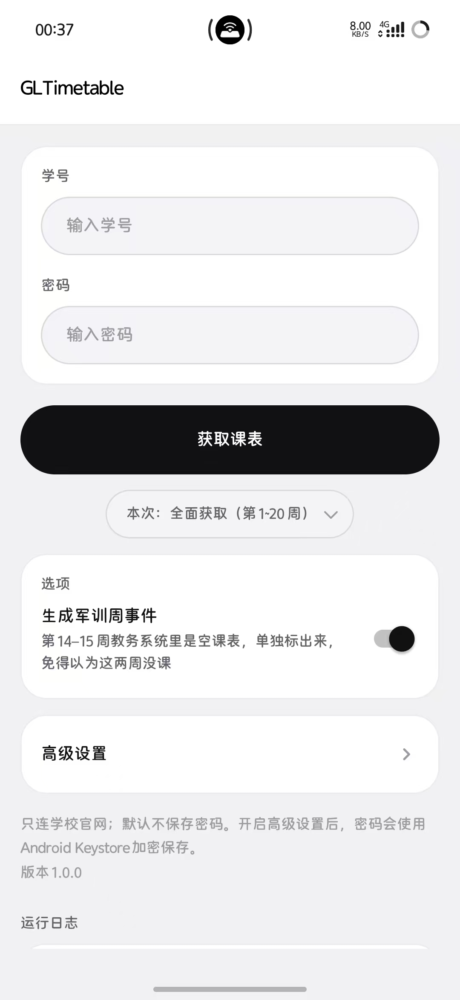
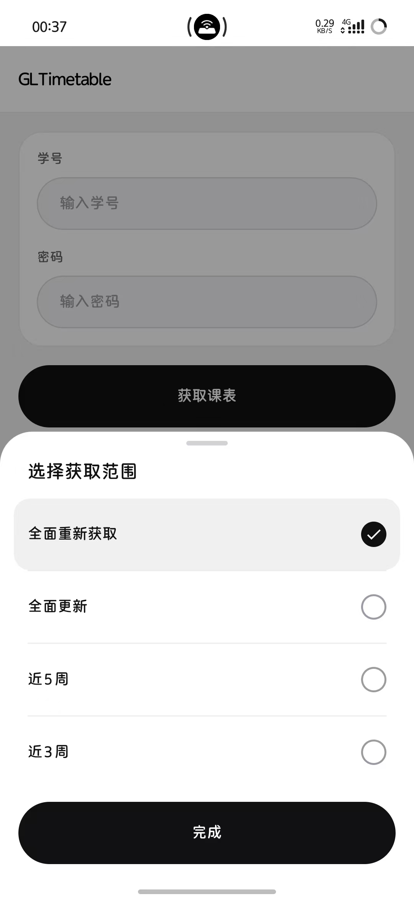
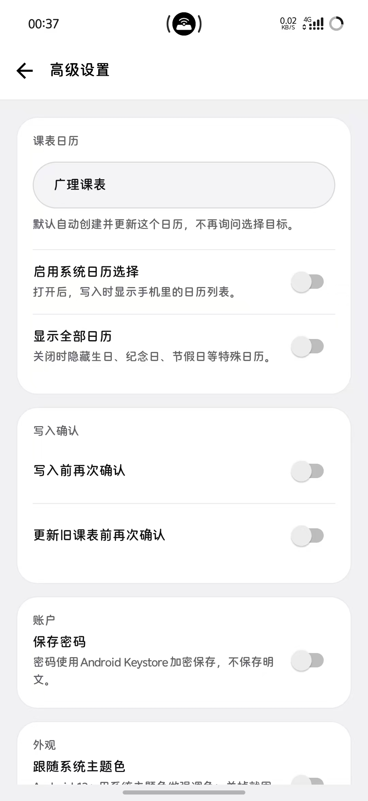
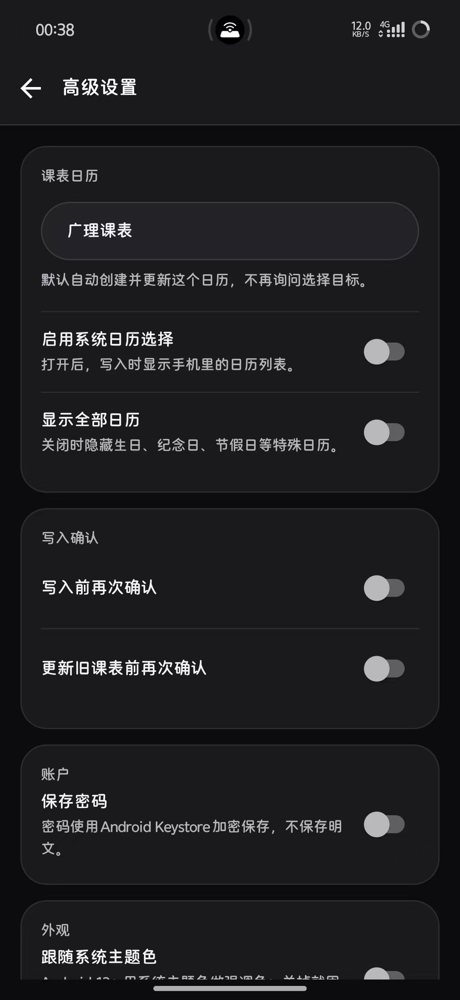

# GLTimetable · 广理课表导出（Android 版）

把**广东理工学院**教务系统的课表，一键弄进手机日历。

和 Windows 版（`CurriculumExporter`）是同一个工具的两个壳：登录方式、抓取逻辑、生成的日历内容完全一致，
区别只在「课表最后落到哪里」。

---

## 应用界面

<p align="center">
  
  
  
  
</p>

---

## 为什么还要个安卓版

Windows 版生成 `.ics` 之后，你得把文件传到手机、用文件管理打开、再选「日历」导入 —— 在手机上这套流程相当绕。

安卓版把最后一步做短了：

- **点一下「写入系统日历」**，课表直接进手机日历，不用任何中转
- 也可以**导出 `.ics`**，自己导入或者发给同学
- 界面跟随系统亮色/暗色模式，黑白配色在夜间不会出现黑底黑字或白底白字

---

## 怎么用

1. 装 APK（首次安装要允许「安装未知来源应用」）
2. 填学号和密码，点「获取课表」
3. 程序自动登录、按上次选定的范围抓一遍（十几秒，界面上一行行打印进度）
   - **想换范围？点按钮下面那一行「本次获取：第 … 周」，或者长按「获取课表」**，
     都会从屏幕底下浮出一个面板：「全面重新获取 / 全面更新 / 近 5 周 / 近 3 周」。
     点一行只是把它**选中**（右边的圆圈涂满并弹一下），按最下面的**「完成」**才把它**记成默认范围**——这时还不会开抓，
     真正开始是你再点一下「获取课表」，按钮下面也会写明这次要抓第几周到第几周。
     「近 3 周」只抓本周和之后两周，两三秒就完事，日常看课表更新够用了。
     不论选哪个，都是**一周一个请求、老老实实串行发**，不会为了快去并发打学校服务器。
   - 窄范围（近 5 周 / 近 3 周）抓来的课表**写入日历时只做增和改、不删**：范围外的课这次没抓到，
     不能当成「教务系统里删了」清掉。想让取消掉的课消失，用「全面重新获取 / 全面更新」跑一次。
4. 抓完跳到预览页，**先看一眼课表对不对**
   - 「按周看」：一周一周地列
   - 「按课程看」：同一门课的上课时段归在一起
5. 选一个出口：
   - **写入系统日历**：默认自动创建或复用独立的「广理课表」日历，只增删改这个 App 自己写入的课程事件（内容变了就地更新、新加的补写、教务系统里删掉的移除）。不会碰你手动添加的事件。在**高级设置**里改选了别的日历后，课表会**整个移过去**：新日历里写一份，旧日历里本 App 写的那份自动清掉，不会两份并存。
   - **保存 .ics**：存在「下载/课表导出/」里；**分享 .ics** 直接点就行，没存过它会先存一份再弹分享面板
6. 需要选择系统日历、显示全部日历、写入前确认或更新前确认时，点主界面「选项」下方的**高级设置**（整行都能点）。

> 课表更新时走**增量同步**：没变化的事件原样留着，所以反复点「写入系统日历」不会重复。App 会给写进去的每个事件打上自己的标记，即便导入记录丢了（清了数据、重装）也能凭标记认回自己写过的那些，不会重写一份。

---

## 关于安全

- **只连学校官网**（`https://jwcydjw.gdlgxy.edu.cn`），没有第三方服务器、没有中转、没有数据上报。
- **默认不保存密码**。如果在高级设置中打开「保存密码」，密码会使用 Android Keystore 加密保存，不写入明文配置、不写日志。
  （学号是记的，省得每次重填。）
- **传输是加密的**。密码在提交前按学校网页**自带的同一套方式**加密，再走 HTTPS。
  （说实话：那套加密的密钥是公开写在学校前端代码里的，因此它实质上等价于明文 —— 这是学校系统的设计问题，不是本 App 引入的。）
- **权限很少**：联网 + 日历读写（只在你要写日历时申请）+ Android 9 及以下的存储写入（只为把 `.ics` 放进「下载」）。
- **代码全在这里**，`app/src/main/java/` 下一共一千多行，随便看。

---

## 常见问题

**导入后课程重复了？**
默认是增量同步，不是「删光重写」：App 先认出自己上次写入的事件，内容变了就地更新、新加的补写、教务系统里删掉的移除，没变化的不动，所以反复点也不会重复。认领靠两重保险——App 自己的导入记录，以及每个事件上带的 `customAppUri` 标记；就算记录丢了（清了应用数据、重装），也能凭标记认回旧事件，不会重写一份。
如果旧版本曾经写入过其他日历，**新版下次写入时会自动把它们清掉**（换过目标日历就只留新日历那一份），不用你手动清理；清理范围只限本 App 自己写入的事件。

**手机上时间差了 8 小时？**
`.ics` 里内嵌了 `Asia/Shanghai` 的 `VTIMEZONE`，正常不该出错。真遇到了可以提 issue。
直接写系统日历那条路不受影响（用的是手机自己的时区设置）。

**课表里第 14、15 周是空的？**
那是军训周。默认会在日历里补一个全天事件标出来，不想要可以在主界面把「生成军训周事件」关掉。

**课表变了怎么办？**
重新抓一次，覆盖导入。只关心最近几周的变化，点按钮下面那一行（或**长按「获取课表」**）选「近 3 周」——两三秒就完事，
写入日历时只会更新这几周，不会动其他周的课。

**日历列表里有些名字是英文？**
新版不用管了：系统预置的生日 / 纪念日 / 倒计时 / 节假日日历都会显示成中文（如「生日 · 本机」「纪念日 · 默认账户」），
只有认不出来的英文内部标识才回退显示原名。你自己起的日历名一律原样显示，不会被改写。

**每次获取都要等十几秒，太慢了？**
点按钮下面那一行「本次获取：第 … 周」（或者**长按「获取课表」**）可以选范围：「全面重新获取」是第 1~20 周全部重抓（最慢），
「全面更新」从本周抓到第 20 周，「近 5 周」「近 3 周」只抓本周往后的几周，两三秒就好。
在面板里点一行、按「完成」，这个范围就记住了，以后点「获取课表」直接用。范围越窄越快，
而且**永远是一周一个请求、串行发送**，不会为了提速去并发，给学校服务器添麻烦。

**能不能自动同步？**
不能，本工具是一次性导出。真正的自动同步需要服务端 CalDAV，不在这个项目范围内。

**会被学校发现吗？**
程序只是在模拟你自己在网页上的操作，一学期就几十个请求。**但请只导出你自己的课表**。

**闪退了、界面突然消失？**
重开一次 App：如果上次是崩着退出的，会自动弹出错误信息，点「复制」发出来就能定位。
这类记录只写在手机本地，不联网、不上传，也随时可以卸载清除。

---

## 给开发者

<details>
<summary>编译 / 技术细节（点开）</summary>

### 技术栈

- **Kotlin + 传统 XML 布局**，Activity 直接继承 `android.app.Activity`
- **0 个第三方运行时依赖**：网络用 `HttpURLConnection`、JSON 用系统 `org.json`、加密用 `javax.crypto`、写日历用 `CalendarContract`、存文件用 `MediaStore`
- `minSdk 26` / `targetSdk 35`，约 1 MB
- 界面只有黑白灰三种颜色，**跟随系统亮 / 暗**（在系统里切深色会立刻换过来），配色集中在 `res/values/colors.xml`、`res/values-night/colors.xml` 和 `themes.xml`
- 动效全部用系统自带 API（`ViewPropertyAnimator` / `ValueAnimator` / 资源动画），没有引入动画库：
  按键按下压一点、抬手带过冲弹回并给一次轻触感，浮层和对话框的遮罩与内容一起淡入，底部面板可以抓着把手往下拽收起

`minSdk 26` 是刻意的：`java.util.Base64` 从 API 26 起可用，这样密码加密逻辑才能被纯 JVM 单元测试覆盖。

### 编译

需要 JDK 17+、Gradle 8.x、Android SDK（platform 35 + build-tools 35.0.0）：

```powershell
powershell -ExecutionPolicy Bypass -File build-apk.ps1
```

产物在 `app/build/outputs/apk/debug/app-debug.apk`，用 debug 签名，可直接侧载。

### 代码结构

```
app/src/main/java/com/quack/curriculumexporter/
├── MainActivity.kt       主界面：登录 + 抓取 + 进度日志 + 长按选范围
├── ResultActivity.kt     结果页：预览 + 写日历 / 导出 .ics
├── EduClient.kt          教务系统客户端（登录、按周抓取）
├── EduCrypto.kt          前端 xC.encrypt 的等价实现
├── IcsBuilder.kt         ICS 生成（折行 / 转义 / 时区 / 军训事件）
├── CalendarWriter.kt     写入系统日历 + 「上次导入了什么」的记录
├── TermWeeks.kt          从抓到的日期网格反推校历起点，算「今天第几周」
├── SettingsActivity.kt   高级设置
├── SettingsStore.kt      应用设置状态
├── SecureCredentials.kt  Android Keystore 加密密码
├── UiTheme.kt            顶栏 / 状态栏的运行时着色
├── Exporter.kt           .ics 落盘 + 分享
├── SchedulePreview.kt    课表预览的富文本渲染
├── Models.kt             CourseItem / WeekData / Schedule
├── AppState.kt           两个 Activity 之间传抓取结果（同一进程静态持有）
├── Sheet.kt              底部弹出面板（选范围、选日历共用，含拖拽收起）
├── DialogBox.kt          自绘圆角对话框
├── SegmentedControl.kt   自写的分段控件
├── ProgressLine.kt       自绘的抓取进度条
├── Snack.kt              底部浮出的提示条（代替系统 Toast）
├── SystemBars.kt         edge-to-edge 下状态栏 / 导航栏的留白
├── CrashReporter.kt      崩溃兜底记录（下次启动弹出来）
├── AppInfo.kt            读版本号
└── Anim.kt               动效小工具（按压 / 入场 / 转场 / 呼吸）
```

### 接口

```
POST https://jwcydjw.gdlgxy.edu.cn/njwhd/login?userNo=<学号>&pwd=<加密口令>&encode=1
POST https://jwcydjw.gdlgxy.edu.cn/njwhd/student/curriculum?week=<1..20>&kbjcmsid=<班级课表标识>
     Header: token: <登录返回的 JWT>
```

密码处理和学校前端 `xC.encrypt` + `btoa` 一致：

```
pwd = base64( base64( AES-128-ECB( JSON.stringify(密码), key=<前端硬编码 key> ) ) )
```

课表接口返回按周的数据：7 天日期网格 + 课程明细（课程名、教师、教室、节次、周次、班级、人数、考核方式）。

> 注意服务端返回时间结束字段的键名是 `endTIme`（大写 I）。代码里先按原样取，取不到再退回 `endTime`。

### ICS 生成的几个细节

- 每个课程时段展开成一个独立 `VEVENT`，`UID = 课程ID-日期-开始时间`
- 内嵌 `VTIMEZONE`（`Asia/Shanghai`），避免手机算错时间
- 按 RFC 5545 折行（每行 ≤ 75 字节，按 UTF-8 字节算）
- 输出 UTF-8 **无 BOM** + CRLF
- 军训（第 14-15 周）单独生成一个全天事件，可在界面里关掉
- 时间字段残缺的课程会被跳过，而不是生成一个 00:00 的假事件

军训日期和日历名（`2026-2027-1 学期课表`）是写死在 `IcsBuilder.kt` 里的学期安排，**换学期要改**。

### 测试

```powershell
gradle testDebugUnitTest
```

覆盖两块最容易出错、又完全不需要设备的纯逻辑：ICS 生成（折行 / 转义 / 事件配对 / 军训开关）和密码加密（AES 往返 + 两层 base64）。

</details>

---

## 免责声明

- 本项目仅供**个人学习与自用**，用于导出**本人**的课表。
- 请勿用于批量抓取他人数据，或对学校服务器造成压力。
- 使用本工具产生的一切后果由使用者自行承担。
- 与广东理工学院官方无关。

## License

MIT
